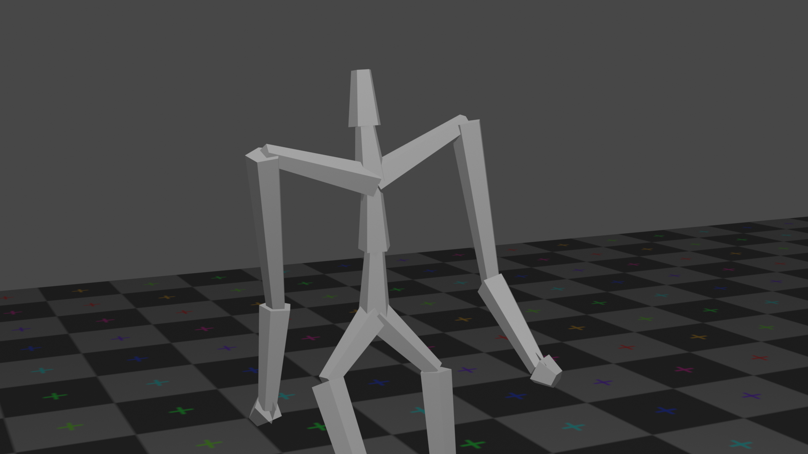
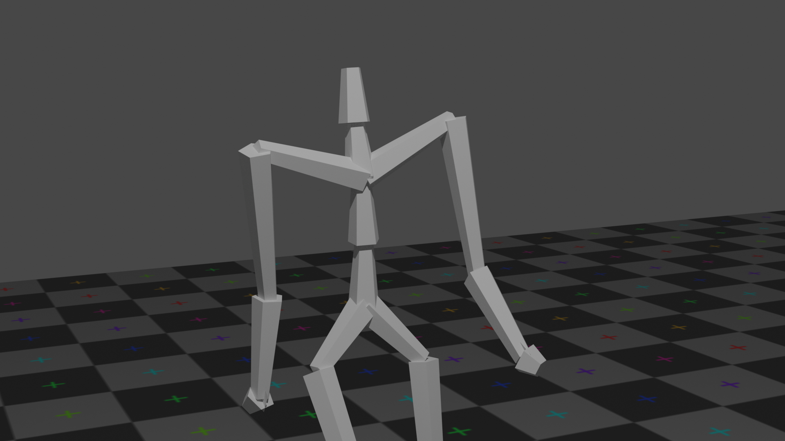

# Deep-motion-editing (under construction)
This library provides fundamental and advanced functions to work with 3D character animation in deep learning with Pytorch. The code contains end-to-end modules, from reading and editing animation files to visualizing and rendering (using Blender) them.

The two main deep editing operations provided here, were proposed in [Skeleton-Aware Networks for Deep Motion Retargeting]() and [Unpaired Motion Style Transfer from Video to Animation](), which are published in SIGGRAPH 2020.

This library is written and maintained by [Kfir Aberman](kfiraberman.github.io), [Peizhuo Li](https://peizhuoli.github.io/) and [Yijia Weng](https://halfsummer11.github.io/).

The library is still under development.


## Quick Start
We provide pretrained models and a few examples that enable one to retarget motion or transfer the style of animation files specified in bvh format.

<!--```bash
python test.py -model_path MODEL_PATH -input_A PATH_A -input_B PATH_B -edit_type TYPE
```-->

### Motion Retargeting
<!-- `TYPE = retargeting`  
`PATH_A` - motion input  
`PATH_B` - skeleton input -->

Download and extract the test dataset from [Google Drive](https://docs.google.com/uc?export=download&id=1_849LvuT3WBEHktBT97P2oMBzeJz7-UP) or [Baidu Disk](https://pan.baidu.com/s/1z1cQiqLUgjfxlWoajIPr0g) (ye1q). Then place the `Mixamo` directory within `retargeting/datasets`.

To generate examples with pretrained model, run

```bash
cd retargeting
python get_examples.py
cd ..
```

The examples will be saved in `retargeting/examples`.

To get quantitative result with pretrained model, run

```bash
cd retargeting
python test.py
cd ..
```

The retargeted demo results, that consists both intra-structual retargeting and cross-structural retargeting, will be saved in `retargeting/pretrained/results`.

<!-- The system support both in Intra-Structural retargeting:
```bash
python test.py -model_path retargeting/models/pretrained_retargeting.pth -input_A retargeting/examples/IS_motion_input -input_B retargeting/examples/IS_skeleton_input -edit_type retargeting
```
(demo result GIF: input_motion, input_skeleton, output)

and Cross-structural retargeting:
```bash
python test.py -model_path retargeting/models/pretrained_retargeting.pth -input_A retargeting/examples/CS_motion_input -input_B retargeting/examples/CS_skeleton_input -edit_type retargeting
```

(demo result GIF: input_motion, input_skeleton, output) -->

### Motion Style Transfer
<!-- `TYPE = style_transfer`  
`PATH_A` - content motion input  
`PATH_B` - style motion input  

The system support both in style from 3D MoCap data:

```bash
python test.py -model_path retargeting/models/pretrained_style_transfer.pth -input_A style_transfer/examples/content_input -input_B style_transfer/examples/3D_style_input -edit_type style_transfer
```

(demo result GIF: input_content, input_style, output)

and in style from 2D key-points (extracted from video):

```bash
python test.py -model_path retargeting/models/pretrained_style_transfer.pth -input_A style_transfer/examples/content_input -input_B style_transfer/examples/2D_style_input -edit_type style_transfer
```
(demo result GIF: input_content, input_style_video, output) -->
To receive the demo examples, simply run
```bash
sh style_transfer/test.sh
```
The results will be saved in `style_transfer/demo_results`,
where each folder contains the raw output `raw.bvh` and the output after footskate clean-up `fixed.bvh`.

## Train from scratch
We provide instructions for retraining our models

### Motion Retargeting

Coming soon...

### Motion Style Transfer

#### Dataset

+ Download the dataset from [Google Drive](https://drive.google.com/drive/folders/1C-_iZJj-PSUWZwh25yAsQe1tLpPm9EZ5?usp=sharing) or [Baidu Drive](https://pan.baidu.com/s/1LtZaX7bQ6kz8TrDWd4FxWA) (zzck). The dataset consists of two parts: one is the taken from the motion style transfer dataset proposed by [Xia et al.](http://faculty.cs.tamu.edu/jchai/projects/SIG15/style-final.pdf) and the other is our BFA dataset, where both parts contain .bvh files retargeted to the standard skeleton of [CMU mocap dataset](http://mocap.cs.cmu.edu/).
+ Extract the .zip files into `style_transfer/data`


+ Pre-process data for training:

  ```bash
  cd style_transfer/data_proc
  sh gen_dataset.sh
  ```

  This will produce `xia.npz`, `bfa.npz` in `style_transfer/data`.

#### Train

After downloading the dataset simply run
```bash
python style_transfer/train.py
```

#### Style from videos

To run our models in test time with your own videos, you first need to use [OpenPose](https://github.com/CMU-Perceptual-Computing-Lab/openpose) to extract the 2D joint positions from the video, then use the resulting JSON files as described in the demo examples.

## Blender Visualization
We provide a simple wrapper of blender's python API (2.80) for rendering 3D animations.

### Prerequisites

> The Blender releases distributed from blender.org include a complete Python installation across all platforms, which means that any extensions you have installed in your systems Python won’t appear in Blender.

To use external python libraries, you need to change the default blender python interpreter by:

1. Remove the built-in python directory: `[blender_path]/2.80/python`.

2. Make a symbolic link or simply copy a python interpreter at [blender_path]/2.80/python. E.g. `ln -s ~/anaconda3/envs/env_name [blender_path]/2.80/python`

This interpreter should be python 3.7.x version and contains at least: numpy, scipy.


### Usage

#### Arguments

Due to blender's argparse system, the argument list should be separated from the python file with an extra '--', for example:

`blender -P render.py -- --arg1 [ARG1] --arg2 [ARG2]`

engine: "cycles" or "eevee". Please refer to `Render` section for more details.

render: 0 or 1. If set to 1, the data will be rendered outside blender's GUI. It is recommended to use render = 0 in case you need to manually adjust the camera.

The full parameters list can be displayed by:
`blender -P render.py -- -h`

#### Load bvh File (`load_bvh.py`)

To load `example.bvh`, run `blender -P load_bvh.py`. Please finish the preparation first.


> Note that currently it uses primitive_cone with 5 vertices for limbs.

> Note that Blender and bvh file have different xyz-coordinate systems. In bvh file, the "height" axis is y-axis while in blender it's z-axis. `load_bvh.py`  swaps the axis in the `BVH_file` class initialization funtion.

> Currently all the `End Sites` in bvh file are discarded, this is because of the out-side code used in `utils/`.

> After loading the bvh file, it's height is normalized to 10.


#### Material, Texture, Light and Camera (`scene.py`)

This file enables to add a checkerboard floor, camera, a "sun" to the scene and to apply a basic color material to character.

The floor is placed at y=0, and should be corrected manually in case that it is needed (depends on the character parametes in the bvh file).


## Rendering

We support 2 render engines provided in Blender 2.80: Eevee and Cycles, where the trade-off is between speed and quality.

Eevee (left) is a fast, real-time, render engine provides limited quality, while Cycles (right) is a slower, unbiased, ray-tracing render engine provides photo-level rendering result. Cycles also supports CUDA and OpenGL acceleration.


<p float="left">
  
  
</p>

## Acknowledgments

The code in the utils directory is mostly taken from [Holden et al. [2016]](http://theorangeduck.com/page/deep-learning-framework-character-motion-synthesis-and-editing)

## Citation
If you use this code for your research, please cite our paper:
```
@article{aberman2020skeleton,
  author = {Aberman, Kfir and Li, Peizhuo and Sorkine-Hornung Olga and Lischinski, Dani and Cohen-Or, Daniel and Chen, Baoquan},
  title = {Skeleton-Aware Networks for Deep Motion Retargeting},
  journal = {ACM Transactions on Graphics (TOG)},
  volume = {38},
  number = {4},
  pages = {62},
  year = {2020},
  publisher = {ACM}
}
```
and
```
@article{aberman2020unpaired,
  author = {Aberman, Kfir and Weng, Yijia and Lischinski, Dani and Cohen-Or, Daniel and Chen, Baoquan},
  title = {Unpaired Motion Style Transfer from Video to Animation},
  journal = {ACM Transactions on Graphics (TOG)},
  volume = {38},
  number = {4},
  pages = {64},
  year = {2020},
  publisher = {ACM}
}
```
